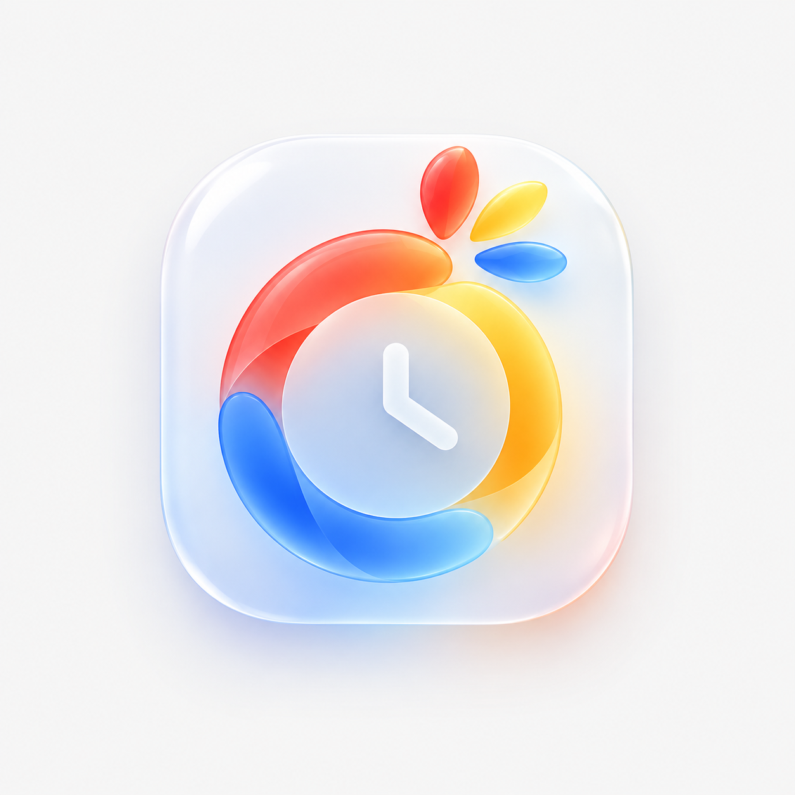
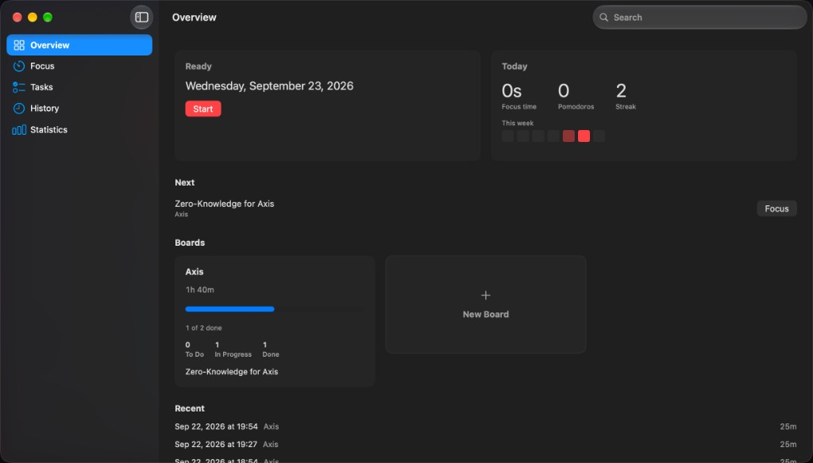
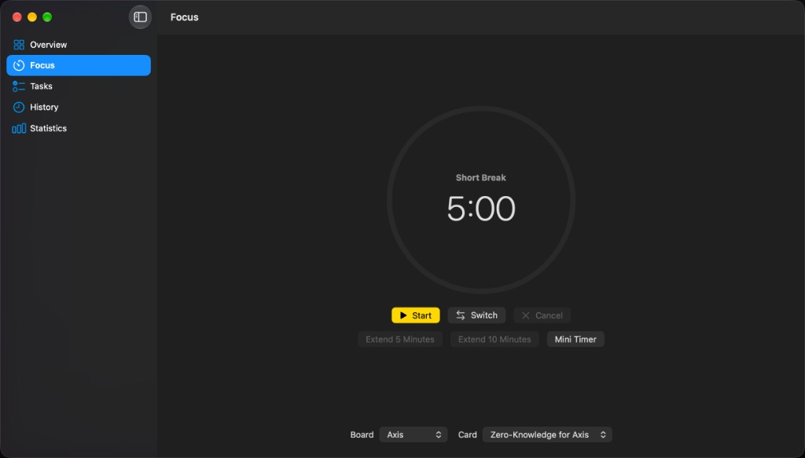
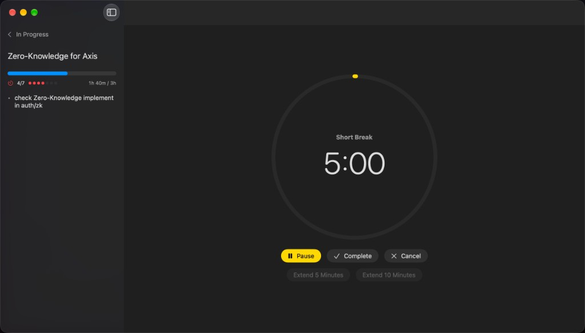
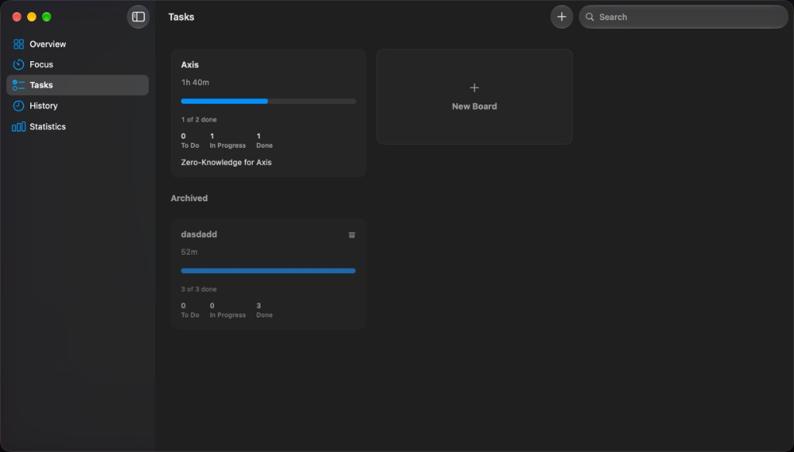
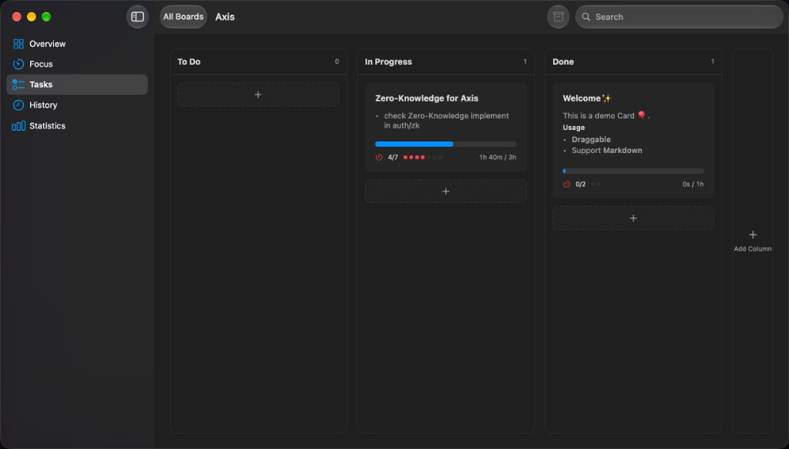
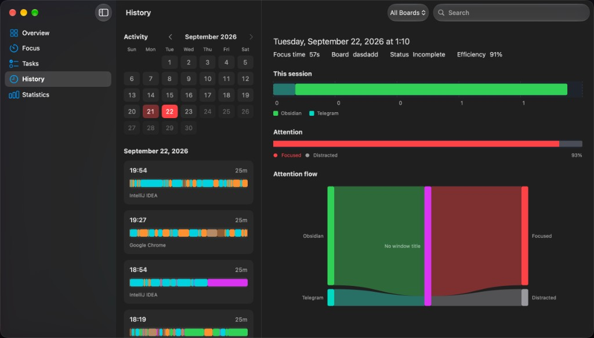
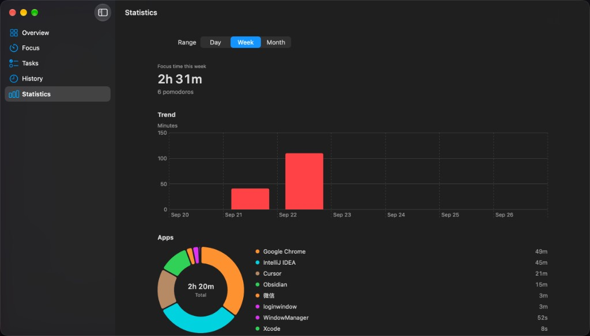

<p align="center">
  
</p>

<h1 align="center">Tempo</h1>

<p align="center">
  本地优先的 macOS 专注应用：番茄计时、任务看板、私有工作历史。
</p>

<p align="center">
  <a href="README.md">English</a> ·
  <a href="README-ZH.md">简体中文</a>
</p>

<p align="center">
  
  
  
  <a href="LICENSE"></a>
</p>

Tempo 是原生 macOS 效率应用。番茄钟、任务看板、会话历史和统计都留在这台 Mac 上，不会上传。

由 **[Crows-Storm](https://github.com/Crows-Storm)** 开发。能力上向 [Pomodoro Logger](https://github.com/zxch3n/PomodoroLogger) 致敬，但是独立的洁净室原生实现：不是 fork，不复用其 Electron 界面或 GPL 源码，许可证也不同。

## 截图

<p align="center">
  
</p>
<p align="center"><em>总览：今日、下一张卡片、看板与最近会话</em></p>

<p align="center">
  
  
</p>
<p align="center"><em>专注计时，以及绑定卡片后的沉浸式会话</em></p>

<p align="center">
  
  
</p>
<p align="center"><em>看板列表（含归档）与卡片看板</em></p>

<p align="center">
  
  
</p>
<p align="center"><em>历史日历与应用流向，以及按周统计</em></p>

## 功能

**专注**
- 经典番茄周期：25 分钟专注、5 分钟短休息、每 4 个专注后 15 分钟长休息（均可在设置里改）
- 开始、暂停、切换阶段、完成、取消，以及延长 5 / 10 分钟
- 会话可绑定看板、绑定卡片、或不绑定；工时只记入当前选中的卡片
- 沉浸式会话：计时进行中会收起 Tempo 自身的导航栏，空闲后恢复
- 迷你计时窗口与菜单栏计时（菜单栏用模板字形，不是彩色 Logo）
- 自然走完，或手动完成且已满 10 分钟，计为一个番茄；不足 10 分钟的手动完成会保留历史，但标记为 rotten

**任务**
- 看板：自定义列、进行中 / 完成角色、置顶、归档、搜索
- 卡片：标题、预估工时、实际工时、Markdown 备注
- 卡片可在列之间拖动；全部完成后看板会归档

**历史与统计**
- 历史是会话日历：热力图、番茄计数、应用 / 窗口流向的 Sankey
- 统计是趋势与应用构成，和历史不是同一页
- 总览是看板与近期工作的独立首页

**隐私**
- SwiftData 书库与活动日志位于本机 Application Support
- 开启 App Sandbox 与 Hardened Runtime
- 专注进行中会采样前台应用名。只有已经授予辅助功能权限时才读取窗口标题。Tempo **不会**自动弹出辅助功能授权；设置里可以打开系统设置，由你自己决定是否授权
- 可选的分心规则会参与效率分数（未命中分心列表的采样占比）

**系统**
- 语言：跟随系统、English、简体中文、日本語
- 外观：跟随系统、浅色、深色
- 登录时打开、通知、声音均可关
- 首次启动可合并已有的 Pomodoro Logger 或旧版 Tempo 数据，不删除原目录

## 运行要求

- macOS 26.0 或更高
- Apple Silicon
- 从源码编译需要 Xcode 26 或更高
- Bundle ID：`app.tempo.macos`

## 编译

```sh
git clone git@github.com:Crows-Storm/Tempo.git
cd Tempo
open Tempo.xcodeproj
```

在 Xcode 中选择 **Tempo** scheme，按 `⌘R` 运行。

命令行：

```sh
export DEVELOPER_DIR=/Applications/Xcode.app/Contents/Developer
xcodebuild -project Tempo.xcodeproj -scheme Tempo \
  -destination 'platform=macOS,arch=arm64' build
```

测试：

```sh
xcodebuild -project Tempo.xcodeproj -scheme Tempo \
  -destination 'platform=macOS,arch=arm64' test
```

## 打包成 DMG

打 Release，再包成可拖进「应用程序」的磁盘映像：

```sh
chmod +x scripts/make-dmg.sh
./scripts/make-dmg.sh
```

成品在 `build/dmg/Tempo-1.0.0.dmg`（版本号跟随 `CFBundleShortVersionString`）。双击打开：左边是 **Tempo**，右边是 **Applications**。把应用拖进文件夹，再推出磁盘。

当前是 **ad-hoc 签名**（`CODE_SIGN_IDENTITY = "-"`）。磁盘映像里**没有** Apple 开发者姓名、Team ID、Apple ID。别人打开时会出现「无法验证开发者」，在应用上右键选「打开」即可。

若用 Developer ID 去公证，反而会把**你的身份**写进签名，并把校验哈希上传给 Apple。不想公开开发者身份就不要走那条路。

## 快捷键

| 操作 | 快捷键 |
| --- | --- |
| 开始或暂停 | Space |
| 切换专注 / 休息（空闲时） | ⌥⌘S |
| 完成 | ⇧⌘S |
| 取消会话 | ⇧⌘. |
| 新建卡片 | ⌘N |
| 新建看板 | ⇧⌘N |
| 查找 | ⌘F |
| 设置 | ⌘, |
| 总览 / 专注 / 任务 / 历史 / 统计 | ⌘1 … ⌘5 |
| 快捷键一览 | ⇧⌘? |

## 数据

| 内容 | 位置 |
| --- | --- |
| 看板、卡片、会话 | `~/Library/Application Support/Tempo/Tempo.store` |
| 活动采样 | `~/Library/Application Support/Tempo/activity.sqlite` |
| 设置与时钟 | UserDefaults（`tempo.settings`、`tempo.clock`） |

关掉最后一个窗口不会退出 Tempo（菜单栏应用）。再点 Dock 图标会重新打开主窗口。

### 导入

首次启动会查找：

- `~/Library/Preferences/PomodoroLogger/db`
- `~/Library/Application Support/Tempo/db`

匹配的记录会合并进来，源目录不会被删除。导入完成后会写标记文件，避免重复导入。

## 目录结构

```
App/                 窗口、应用模型、图标、entitlements
Core/                计时器、设置、分析、导入、领域规则
Features/            总览、专注、任务、历史、统计、设置、菜单栏
Infrastructure/      SwiftData、活动探测、macOS 外壳、通知
Shared/              设计系统、本地化
TempoTests/          计时、导入、图表与会话规则的 XCTest
docs/screenshots/    README 产品截图
scripts/             Icon Composer 资源脚本
```

只有 SwiftUI 够不到的原生能力才用 AppKit（菜单栏 Extra、设置窗口、辅助功能、Dock / 激活策略）。其余界面都是 SwiftUI。

## 许可证

Copyright © 2026 **Crows-Storm**。

本项目采用 [知识共享署名-非商业性使用 4.0 国际许可协议](https://creativecommons.org/licenses/by-nc/4.0/)（CC BY-NC 4.0）。全文见 [LICENSE](LICENSE)。

简要含义：

- 可在**非商业**前提下复制、分享和改编 Tempo
- 必须为 Crows-Storm 署名
- **不得**将材料用于商业优势或金钱报酬，除非另行获得许可
- 不授予专利或商标权利

## 致谢

- **Crows-Storm** — Tempo 的设计与开发
- [zxch3n/PomodoroLogger](https://github.com/zxch3n/PomodoroLogger) — Tempo 向其致敬。Pomodoro Logger 仍是独立的 GPL Electron 应用；Tempo 是另一套原生实现
- Apple Human Interface Guidelines — 布局、设置、动效与 macOS 外壳

## 仓库

https://github.com/Crows-Storm/Tempo
